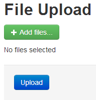

# AngularJS File Upload

## Introduction

Recently I had some time to play around with [AngularJS](http://angularjs.org/). More specifically I had to implement a jQuery based [file upload widget](http://blueimp.github.io/jQuery-File-Upload/).

The widget's demo site already contains an AngularJS demo, but I wanted a minimum setup, so I started from scratch and figured out the necessary parts to implement the file upload using ASP.NET MVC as the server-side platform.

Let's see which steps we need to take to implement a basic version.

## Server Side

Let's focus on the server-side part first.

```csharp
public class HomeController : Controller
{
    public ActionResult Index()
    {
        return View();
    }
}
```

Can't get much simpler.

Now you'll just need to add one more action method which handles a file upload.

```csharp
public ContentResult Upload(HttpPostedFileBase file)
{
    var filename = Path.GetFileName(file.FileName);
    var path = Path.Combine(Server.MapPath("~/uploads"), filename);
    file.SaveAs(path);

    return new ContentResult
    {
        ContentType = "text/plain",
        Content = filename,
        ContentEncoding = Encoding.UTF8
    };
}
```

The code is self-explanatory. When a file is uploaded (POST) the data is bound to the file parameter which is of type [HttpPostedFileBase](http://msdn.microsoft.com/en-us/library/system.web.httppostedfilebase.aspx). The file name is extracted and the file is saved on the server. Finally we return the file name as plain text.

Voila, that's all the server side code you'll need.

**Remark**: I had to explicitly set the content type otherwhise IE will prompt you to download the result. Feel free to change the content type (e.g. JSON) and return something else than the filename instead.

## Dependencies

When setting up a small demo site I developed the tendency to implement [Twitter Bootstrap](http://twitter.github.io/bootstrap/) so that I can easily style it. If you are not familiar with Bootstrap, check out the following article to get started:

[Getting started with Twitter Bootstrap](https://github.com/geersch/TwitterBootstrap)

So if you see some unfamiliar CSS in the HTML listings you know where it's coming from.

Apart from Bootstrap and the jQuery file upload widget you'll need to include the following resources:

- [jQuery](http://jquery.com/)
- [jQuery UI Widget](http://jqueryui.com/)
- [AngularJS](http://angularjs.org/)

The [download package](https://github.com/blueimp/jQuery-File-Upload/tags) of the jQuery file upload contains a couple of JS files, but you'll only need the jquery.fileupload.js library.

## Module

Let's create a custom Angular module. Add a new script file called app.js to the project and add the following code to it:

```js
(function () {
  "use strict";

  var myApp = angular.module("myApp", []);
})();
```

Don't forget to bootstrap the application.

```html
<html ng-app\="myApp"\>
...
</html\>
```

The root of our Angular application is now defined, let's flesh out the rest.

## Layout

The file upload control looks as follows:



Let's compose the HTML to create this layout. First add a DIV and link it an Angular controller named FileUploadCtrl. Ignore the controller for now, we'll get back to it later.

```html
<h2>File Upload</h2>
<div ng-controller="FileUploadCtrl">...</div>
```

The remaining HTML can be split into three sections:

- Select (files) button
- List of selected files
- Upload button

Start by adding the HTML for the select button.

```html
<div class="control-group">
  <div class="controls">
    <span class="btn btn-success fileinput-button">
      <i class="icon-plus icon-white"></i>
      <input
        type="file"
        name="file"
        data-url="home/upload"
        multiple
        upload
      /><span>Add files...</span>
    </span>
  </div>
</div>
```

**Remark**: You'll need to include some [additional CSS](https://dl.dropboxusercontent.com/u/40603470/fileinput-button.css) to properly style the file upload input, because by default it is designed to be butt-ugly (I borrowed this CSS from the file upload demo page).

Next add a list to display the selected files names. The list is bound to an array (files) of our Angular controller.

```html
<div>
  <span ng-show="!files.length">No files selected</span>
  <ul>
    <li ng-repeat="file in files">{{file}}</li>
  </ul>
</div>
```

Last, but not least: the Upload button.

```html
<div class="form-actions">
  <button type="submit" class="btn btn-primary pull-left" ng-click="upload()">
    Upload
  </button>
</div>
```

Clicking the button will invoke the upload function on the controller's scope.

## FileUploadCtrl

Time to add our FileUploadCtrl to our Angular module.

```js
myApp.controller("FileUploadCtrl", [
  "$scope",
  "$rootScope",
  "uploadManager",
  function ($scope, $rootScope, uploadManager) {
    $scope.files = [];
    $scope.percentage = 0;

    $scope.upload = function () {
      uploadManager.upload();
      $scope.files = [];
    };

    $rootScope.$on("fileAdded", function (e, call) {
      $scope.files.push(call);
      $scope.$apply();
    });

    $rootScope.$on("uploadProgress", function (e, call) {
      $scope.percentage = call;
      $scope.$apply();
    });
  },
]);
```

We inject 3 dependencies into the controller: $scope, $rootScope and uploadManager. The latter being a custom service which manages the files that we want to upload. The scope has two properties, files (array) and percentage (int). The files array contains the name of the files to be uploaded. We'll get back to the percentage later.

When you click the upload button the upload function on the scope is called. It informs the uploadManager service to start uploading the files and resets the files array.

Via the $rootScope we also listen to two events, fileAdded and uploadProgress, which are broadcast by the uploadManager service. Each time a file is added using the third-party jQuery plugin the fileAdded event is triggered. When this happens we add the filename to the files array. The uploadProgress event is triggered when the widget is busy uploading the files. Here we update the percentage property. Later we'll bind this to a progress bar.

## uploadManager service

The uploadManager service is fairly straightforward. It manages the files you wish to upload, it allows you to communicate between the third party file upload widget and your Angular controller.

Only the $rootScope is injected as a dependency. We use it to broadcast the two events (fileAdded and uploadProgress) we mentioned earlier.

```js
myApp.factory("uploadManager", function ($rootScope) {
  var _files = [];
  return {
    add: function (file) {
      _files.push(file);
      $rootScope.$broadcast("fileAdded", file.files[0].name);
    },
    clear: function () {
      _files = [];
    },
    files: function () {
      var fileNames = [];
      $.each(_files, function (index, file) {
        fileNames.push(file.files[0].name);
      });
      return fileNames;
    },
    upload: function () {
      $.each(_files, function (index, file) {
        file.submit();
      });
      this.clear();
    },
    setProgress: function (percentage) {
      $rootScope.$broadcast("uploadProgress", percentage);
    },
  };
});
```

## upload Directive

So the uploadManager service triggers events to which our controller listens and consequently updates its scope. But who then notifies this service of events triggered by the file upload widget?

That's where our custom upload directive comes into play. Take a look again at the input element for the file upload listed earlier.

```html
<input type="file" name="file" data-url="home/upload" multiple upload /><span
  >Add files...</span
>
```

The data-url attribute points to the URL the files are POSTed to. Note the upload attribute. This extends the input element. Let's discover what it does.

```js
myApp.directive("upload", [
  "uploadManager",
  function factory(uploadManager) {
    return {
      restrict: "A",
      link: function (scope, element, attrs) {
        $(element).fileupload({
          dataType: "text",
          add: function (e, data) {
            uploadManager.add(data);
          },
          progressall: function (e, data) {
            var progress = parseInt((data.loaded / data.total) * 100, 10);
            uploadManager.setProgress(progress);
          },
          done: function (e, data) {
            uploadManager.setProgress(0);
          },
        });
      },
    };
  },
]);
```

First we have Angular inject the uploadManager service. We then use the link function to transform the DOM. Here our element is turned into a file upload widget. The widget supports a number of callbacks. Here we only use the add, progressall and done callbacks. When these are triggered by the widget we notify the uploadManager. For example when a file is added we pass this to the uploadManager which then broadcasts the fileAdded event. Since our controller is listening for this event, it'll be notified when a new file has been selected.

## Progress bar

Let's get back to that progress property on the scope of our controller. Each time the uploadManager service broadcasts the uploadProgress event we update the percentage.

This way you can easily add a [progress bar](http://twitter.github.io/bootstrap/components.html#progress) and show the upload progress. For example:

```html
<div class="progress" ng-show="percentage">
  <div class="bar" style="width: {{percentage}}%;"></div>
</div>
```

## Summary

To recapitulate, we have 3 components that make up our Angular application:

- **FileUploadCtrl**: Our controller which is tied to a DIV which contains the file upload widget
- **uploadManager Service**: This service manages the files we want to upload. It sends out a couple of events to which our controller listens and acts to accordingly.
- **upload Directive**: This directive transforms the file input into a bonafide upload widget. It uses the widget's callbacks to notify the uploadManager service.

And that's basically all there is too it. I tested the code in Chrome and IE8. If you have any issues or suggestions please let me know.
